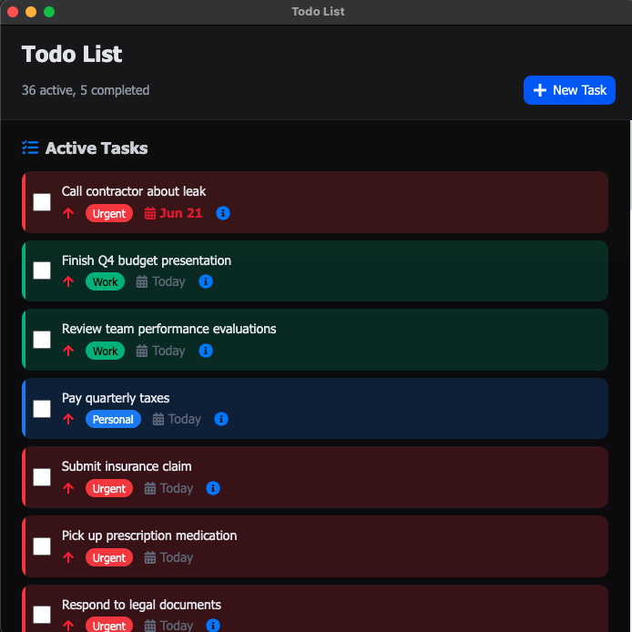

# Todo List Desktop App

<div align="center">
  
  <h3>🚀 A modern, elegant desktop todo application</h3>
  <p>Built with Electron, React 19, TypeScript, and Tailwind CSS</p>
  
  
  
  
  
</div>

---

## 📸 Screenshot

<div align="center">
  
  <p><em>Clean, modern interface with dark mode support</em></p>
</div>

---

## ✨ Features

### 🎯 Task Management

- **Create, Edit & Delete** - Full CRUD operations with intuitive UI
- **Task Completion** - Mark tasks as done with smooth animations
- **Bulk Operations** - Delete multiple tasks at once
- **Smart Sorting** - Auto-sort by priority, due date, and overdue status

### 🏷️ Organization

- **Custom Categories** - Color-coded categories with visual indicators
- **Priority Levels** - High, Medium, Low priority with visual cues
- **Due Dates** - Calendar picker with overdue notifications
- **Extra Details** - Rich text details with popover display

### 🎨 User Experience

- **Drag & Drop** - Reorder active tasks effortlessly
- **Dark Mode** - System-aware theme switching
- **Keyboard Shortcuts** - Full productivity shortcuts support
- **Animations** - Smooth transitions and micro-interactions
- **Responsive Design** - Adaptive layout for different window sizes

### 💾 Data Management

- **Persistent Storage** - Local file-based storage
- **Export Options** - JSON (full backup) and CSV (analysis)
- **Import Support** - Restore from previous exports
- **Data Validation** - Robust error handling and data integrity

### 🌍 Internationalization

- **Multi-language Support** - 10 languages included
- **Dynamic Language Switching** - Change language without restart
- **Localized Date Formats** - Region-appropriate date displays

---

## 🛠️ Tech Stack

### Frontend

- **React 19** - Latest React with concurrent features
- **TypeScript** - Full type safety and IntelliSense
- **Tailwind CSS v4** - Utility-first styling with custom design system
- **Radix UI** - Accessible component primitives
- **React Icons** - Comprehensive icon library

### Desktop

- **Electron 36** - Cross-platform desktop framework
- **electron-vite** - Fast Vite-powered build system
- **electron-builder** - Multi-platform packaging

### Development

- **ESLint** - Code quality and consistency
- **Prettier** - Code formatting
- **TypeScript strict mode** - Enhanced type checking

---

## 🚀 Quick Start

### Prerequisites

- **Node.js** v18 or higher
- **npm**, **yarn**, or **pnpm**

### Installation

```bash
# Clone the repository
git clone https://github.com/chiefpansancolt/todo-list-app.git
cd todo-list-app

# Install dependencies
npm install
```

### Development

```bash
# Start development server with hot reload
npm run dev

# The app will open automatically with:
# - Hot reload for renderer process
# - Automatic restart for main process
# - DevTools enabled
```

### Building for Production

```bash
# Build for current platform
npm run build:unpack

# Platform-specific builds
npm run build:win     # Windows (NSIS installer)
npm run build:mac     # macOS (DMG)
npm run build:linux   # Linux (AppImage, Snap, Deb)
```

---

## 📁 Project Structure

```text
├── app/                    # Renderer Process (React App)
│   ├── components/         # React Components
│   │   ├── ui/            # Reusable UI Components (shadcn/ui)
│   │   ├── TodoApp.tsx    # Main Application
│   │   ├── TaskItem.tsx   # Task Component
│   │   └── TaskModal.tsx  # Task Form Modal
│   ├── hooks/             # Custom React Hooks
│   │   └── useTodoStore.ts # State Management
│   ├── styles/            # Styling
│   │   ├── globals.css    # Global Styles & Variables
│   │   └── todo.css       # Component-specific Styles
│   └── types/             # TypeScript Definitions
│       ├── todo.d.ts      # Core Data Types
│       └── props.d.ts     # Component Props
├── lib/                   # Electron Processes
│   ├── main/              # Main Process
│   │   ├── main.ts        # App Entry Point
│   │   ├── app.ts         # Window & Menu Management
│   │   └── todoHandlers.ts # IPC Data Handlers
│   └── preload/           # Preload Scripts
│       ├── preload.ts     # Context Bridge Setup
│       └── api.ts         # IPC API Wrapper
├── locales/               # Internationalization
│   ├── en/                # English Translations
│   └── [lang]/            # Other Languages
├── resources/             # App Resources
│   └── build/             # Build Assets
└── electron.vite.config.ts # Build Configuration
```

---

## ⌨️ Keyboard Shortcuts

| Shortcut               | Action             |
| ---------------------- | ------------------ |
| `Ctrl/Cmd + N`         | New Task           |
| `Ctrl/Cmd + T`         | Manage Categories  |
| `Ctrl/Cmd + D`         | Toggle Dark Mode   |
| `Ctrl/Cmd + Shift + D` | Toggle Delete Mode |
| `Ctrl/Cmd + I`         | Import Data        |
| `Ctrl/Cmd + Shift + E` | Export as JSON     |
| `Escape`               | Cancel/Close Modal |

---

## 🏗️ Architecture

### State Management

Uses a custom hook pattern with `useTodoStore`:

- Local state with React hooks
- Persistent storage via IPC
- Optimistic updates with error handling

### IPC Communication

Secure communication between processes:

- `contextBridge` for security
- Type-safe IPC channels
- Async/await pattern for data operations

### Data Flow

```text
React Components → useTodoStore → IPC → Main Process → File System
```

### File Storage

```text
~/Library/Application Support/Todo List/  (macOS)
%APPDATA%/Todo List/                      (Windows)
~/.config/Todo List/                      (Linux)
├── tasks.json      # Task data
├── categories.json # Category definitions
└── language.json   # User preferences
```

---

## 🎨 Customization

### Adding New Languages

1. Create language file in `locales/[lang]/index.ts`
2. Add language to `locales/index.ts`
3. Update menu in `lib/main/app.ts`

### Custom Themes

Modify CSS variables in `app/styles/globals.css`:

```css
:root {
  --primary: oklch(0.623 0.214 259.815);
  --background: oklch(1 0 0);
  /* ... other variables */
}
```

### Component Development

Follow the established patterns:

- Use TypeScript for all components
- Implement proper accessibility
- Include proper error boundaries
- Add loading states where appropriate

---

## 📦 Packaging & Distribution

### Build Outputs

- **Windows**: `.exe` installer (NSIS)
- **macOS**: `.dmg` disk image
- **Linux**: `.AppImage` and `.deb` packages

---

## 🤝 Contributing

1. **Fork** the repository
2. **Create** a feature branch: `git checkout -b feature/amazing-feature`
3. **Commit** changes: `git commit -m 'Add amazing feature'`
4. **Push** to branch: `git push origin feature/amazing-feature`
5. **Open** a Pull Request

### Development Guidelines

- Follow TypeScript strict mode
- Use conventional commit messages
- Add tests for new features
- Update documentation

---

## 🐛 Troubleshooting

### Common Issues

**Data not saving:**

- Check app permissions for file system access
- Verify user data directory is writable

---

## 📈 Changelog

For complete changelog, see [CHANGELOG.md](CHANGELOG.md)

---

## 💖 Support the Project

If you find this project helpful, consider supporting its development:

<div align="center">
  
[](https://github.com/sponsors/chiefpansancolt)
[](https://ko-fi.com/chiefpansancolt)
[](https://patreon.com/chiefpansancolt)

</div>

Your support helps:

- 🚀 **New Features** - Continued development and improvements
- 🐛 **Bug Fixes** - Faster issue resolution and testing
- 📚 **Documentation** - Better guides and tutorials
- 🌍 **Community** - Maintaining Discord server and support

---

## 📄 License

MIT License - see [LICENSE](LICENSE) for details.

---

## 🙏 Acknowledgments

- [Electron](https://electronjs.org) - Cross-platform desktop apps
- [React](https://reactjs.org) - UI library
- [Tailwind CSS](https://tailwindcss.com) - Utility-first CSS
- [Radix UI](https://radix-ui.com) - Accessible components
- [shadcn/ui](https://ui.shadcn.com) - Component patterns

---

<div align="center">
  <p>Built with ❤️ by <a href="https://chiefpansancolt.dev">chiefpansancolt</a></p>
  <p>
    <a href="https://discord.gg/chiefpansancolt">💬 Discord</a> •
    <a href="https://github.com/chiefpansancolt/todo-list-app">🌟 GitHub</a>
  </p>
</div>
